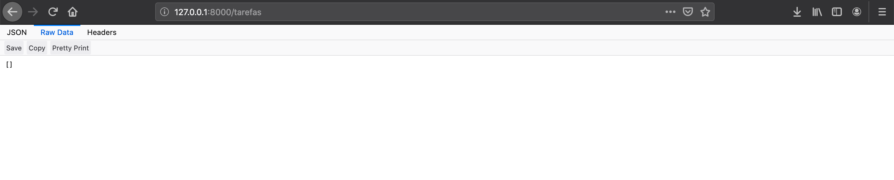
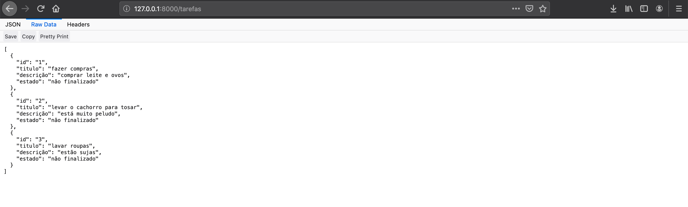
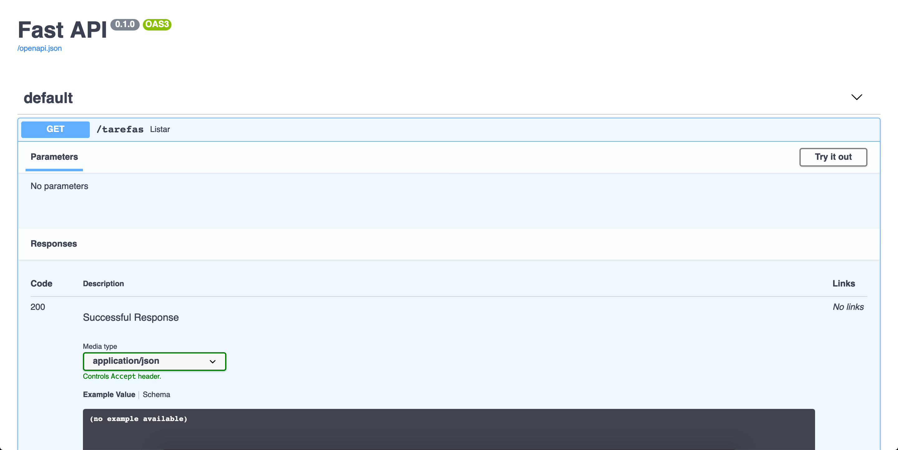

# ⚡ Hello FastAPI

<figure markdown>
  
  <figcaption></figcaption>
</figure>

É chegada a tão esperada hora de escrevermos código, porém, como aprendemos que podemos ser guiados por testes para ajudar a concepção da arquitetura do nosso programa, faremos as coisas um pouco diferente.

Utilizaremos os ciclos do TDD para nos auxiliarem e assim garantiremos uma qualidade de código ao final.

Estão lembrados o que é a nossa aplicação? Caso não se recorde leia as [regras de negócio](./planejando.md) novamente.

Vamos dividir algumas tarefas então, na nossa lista de funcionalidades:

- [ ] listar as tarefas
- [ ] adicionar tarefa
- [ ] remover tarefa
- [ ] ordenar a listagem por estado
- [ ] finalizar uma tarefa
- [ ] exibir uma tarefa de forma detalhada

Acho que para iniciarmos o mais simples de escrever e testar é a funcionalidade de listagem de tarefas.

Mas como fazer isto se não temos tarefas, nem mesmo uma aplicação ainda? Por onde começo?

Inicie criando um diretório com o nome `tests`, onde colocaremos os testes do nosso programa.

Lá dentro, crie um arquivo com nome `test_gerenciador.py` que deve ficar da seguinte maneira.

```
.
├── dev-requirements.txt
├── LICENSE
├── README.md
├── requirements.txt
└── tests
    └── test_gerenciador.py
```

Agora vamos escrever nosso primeiro teste!

Nossa listagem de tarefas, se bem sucedida, deve retornar o código de status `200 OK` e este será nosso primeiro teste.

Traduzindo em um teste automatizado que deve ser acrescentado ao arquivo test_gerenciador.py.

```python
from fastapi.testclient import TestClient
from fastapi import status
from gerenciador_tarefas import app


def test_quando_listar_tarefas_devo_ter_como_retorno_codigo_de_status_200():
    cliente = TestClient(app)
    resposta = cliente.get("/tarefas")
    assert resposta.status_code == status.HTTP_200_OK
```

Vamos rodar pela primeira vez os testes no nosso projeto.

`python -m pytest`

😱 Nossa! Ocorreu um erro!

```
$ python -m pytest
========================================================= test session starts =========================================================
platform linux -- Python 3.10.4, pytest-7.1.2, pluggy-1.0.0
rootdir: /home/cassiobotaro/Projects/gerenciador-tarefas
plugins: anyio-3.6.1
collected 0 items / 1 error

=============================================================== ERRORS ================================================================
_____________________________________________ ERROR collecting tests/test_gerenciador.py ______________________________________________
ImportError while importing test module '/home/cassiobotaro/Projects/gerenciador-tarefas/tests/test_gerenciador.py'.
Hint: make sure your test modules/packages have valid Python names.
Traceback:
../../.asdf/installs/python/3.10.4/lib/python3.10/importlib/__init__.py:126: in import_module
    return _bootstrap._gcd_import(name[level:], package, level)
tests/test_gerenciador.py:3: in <module>
    from gerenciador_tarefas.gerenciador import app
E   ModuleNotFoundError: No module named 'gerenciador_tarefas.gerenciador'
======================================================= short test summary info =======================================================
ERROR tests/test_gerenciador.py
!!!!!!!!!!!!!!!!!!!!!!!!!!!!!!!!!!!!!!!!!!!!!!! Interrupted: 1 error during collection !!!!!!!!!!!!!!!!!!!!!!!!!!!!!!!!!!!!!!!!!!!!!!!!
========================================================== 1 error in 0.30s ===========================================================

```

Não se desespere, é que temos um teste, mas ainda não começamos a escrever código da nossa aplicação.

A primeira coisa que precisamos fazer é criar um  diretório onde colocaremos nossos códigos. vamos chama-lo de `gerenciador_tarefas`.

Dentro dele criamos um novo arquivo `gerenciador.py`, e neste arquivo vamos iniciar uma aplicação da seguinte maneira.

```
.
├── dev-requirements.txt
├── gerenciador_tarefas
│   └── gerenciador.py
├── LICENSE
├── README.md
├── requirements.txt
└── tests
    └── test_gerenciador.py
```

O conteúdo desse arquivo será o seguinte.

```python
from fastapi import FastAPI


app = FastAPI()
```

Isto é uma maneira de fazer os testes conhecerem o código da nossa aplicação. Toda vez que precisamos de um trecho de código em outro arquivo devemos fazer a "importação" daquele trecho utilizando o comando import.

Neste caso estamos requisitando a aplicação nos arquivos de testes automatizados, para escrevermos os testes necessários.

Rode novamente os testes.

`python -m pytest`

❌ Os testes continuam falhando!

```python
# ...
>       assert resposta.status_code == status.HTTP_200_OK
E       assert 404 == 200
E        +  where 404 = <Response [404]>.status_code
E        +  and   200 = status.HTTP_200_OK
# ...
```

O teste está dizendo que esperámos um código de status de sucesso, porém o recurso (`tarefas`) não foi encontrado, por isso o código 404.

Agora temos nossa aplicação, mas nosso recurso de tarefas ainda não foi criado.

No arquivo `gerenciador.py` adicione a seguinte função.

```python
@app.get("/tarefas")
def listar():
    return ""
```

Rode novamente os testes.

`python -m pytest`

```python
$ python -m pytest
========================================================= test session starts =========================================================
platform linux -- Python 3.10.4, pytest-7.1.2, pluggy-1.0.0
rootdir: /home/cassiobotaro/Projects/gerenciador-tarefas
plugins: anyio-3.6.1
collected 1 item

tests/test_gerenciador.py .                                                                                                     [100%]

========================================================== 1 passed in 0.23s ==========================================================
```

✅ Legal! Temos um teste funcionando! Nossa aplicação está retornando status 200 OK, ainda que a funcionalidade completa não esteja pronta.

👶 Damos o nome de `baby step`, esta maneira de construir uma aplicação dando pequenos passos de cada vez.

Nosso recurso deve ter o formato [json](http://json.org/), que é um formato textual estruturado, bem simples e leve para troca de informações.

Mas como checamos isto?

Vamos escrever um novo teste!

No arquivo `test_gerenciador.py`, adicione o seguinte teste.

```python
def test_quando_listar_tarefas_formato_de_retorno_deve_ser_json():
    cliente = TestClient(app)
    resposta = cliente.get("/tarefas")
    assert resposta.headers["Content-Type"] == "application/json"
```

Rode os testes novamente. Caso esqueça o comando, volte um pouco atrás e copie.

Uai? O novo teste está passando ?!?!

Acontece que por padrão, o fastapi já define que o formato será "json".

Normalmente, queremos que testes falhem, porém este teste pode ser útil como documentação do seu recurso.

Vamos deixa-lo e vamos seguir em frente, mas agora tentando escrever um teste que realmente falhe.

Quando listar tarefas o retorno deve possuir o formato de lista. Transformando isto em código temos:

```python
def test_quando_listar_tarefas_retorno_deve_ser_uma_lista():
    cliente = TestClient(app)
    resposta = cliente.get("/tarefas")
    assert isinstance(resposta.json(), list)
```

E vamos continuar o nosso ciclo e rodar os testes.

❌ O teste falha e isto é bom!

Acontece que nosso retorno não é uma lista. Mas como corrigir isto?

Se temos um teste que falha, precisamos escrever o código necessário para este teste passar.

Vamos voltar ao nosso gerenciador.py para corrigir o nosso problema. Na função que expõe o nosso recurso, modifique o código para:

```python
@app.get("/tarefas")
def listar():
    return []
```

Corrigido o código, rode novamente os testes.

✅ Aew! Testes estão passando novamente!


Neste passo os arquivos devem estar da seguinte maneira.

**test_gerenciador.py**
```python
from fastapi.testclient import TestClient
from fastapi import status
from gerenciador_tarefas.gerenciador import app


def test_quando_listar_tarefas_devo_ter_como_retorno_codigo_de_status_200():
    cliente = TestClient(app)
    resposta = cliente.get("/tarefas")
    assert resposta.status_code == status.HTTP_200_OK


def test_quando_listar_tarefas_formato_de_retorno_deve_ser_json():
    cliente = TestClient(app)
    resposta = cliente.get("/tarefas")
    assert resposta.headers["Content-Type"] == "application/json"


def test_quando_listar_tarefas_retorno_deve_ser_uma_lista():
    cliente = TestClient(app)
    resposta = cliente.get("/tarefas")
    assert isinstance(resposta.json(), list)
```

**gerenciador.py**
```python
from fastapi import FastAPI


app = FastAPI()


@app.get("/tarefas")
def listar():
    return []
```

Repare que pouco a pouco nossa aplicação vai tomando forma a partir dos testes.

Parece chato ter de ficar rodando os testes a cada vez, mas além de garatir a qualidade do código, cada vez que os testes são rodados, todas as funcionalidades testadas anteriormente são verificadas novamente. Assim você evita ter de lembrar todas as possibilidades a serem testadas em um teste manual.

🚦 Perceberam que estamos guiando o nosso desenvolvimento a partir dos testes? Pouco a pouco temos a funcionalidade de listagem sendo desenhada.

Vamos continuar então. Sabemos que quando não há tarefas, nossa resposta do recurso deve ser uma lista vazia.

Mas e quando a lista de tarefas possuir conteúdo? Qual o retorno esperado?

Vamos criar uma lista de tarefas, adicionaremos conteúdo a ela e este conteúdo deve ser retornado.

Para fazermos esta checagem, vamos pegar uma tarefa da lista e verificar os seus campos.

O teste automatizado para isto pode ser escrito da seguinte maneira.

```python
def test_quando_listar_tarefas_a_tarefa_retornada_deve_possuir_id():
    TAREFAS.append({"id": 1})
    cliente = TestClient(app)
    resposta = cliente.get("/tarefas")
    assert "id" in resposta.json().pop()
    TAREFAS.clear()
```

❌ Rodou os testes? Pois é, estão quebrando novamente pois TAREFAS não foi definido.

Vamos lá no arquivo `gerenciador.py` e defini-lo.

```python
# ...
TAREFAS = {}
# ...
```

!!! info
    Não esqueça de ir no arquivo de testes e importar TAREFAS do gerenciador

`from gerenciador_tarefas.gerenciador import app, TAREFAS`

❌ Os testes ainda estão quebrando?

Sim, mas agora o erro é outro. O erro mostrado é `IndexError: pop from empty list`, e isto ocorre porque lá no gerenciador ainda estamos retornando uma lista vazia e não a lista de tarefas.

Vamos modificar isto como abaixo:

```python
@app.get("/tarefas")
def listar():
    return TAREFAS
```

Repita este processo para cada um dos campos de uma tarefa, então teremos que verificar titulo, descrição e o estado da tarefa.

No fim nos testes ficam:

```python
from fastapi.testclient import TestClient
from fastapi import status
from gerenciador_tarefas.gerenciador import app, TAREFAS


def test_quando_listar_tarefas_devo_ter_como_retorno_codigo_de_status_200():
    cliente = TestClient(app)
    resposta = cliente.get("/tarefas")
    assert resposta.status_code == status.HTTP_200_OK


def test_quando_listar_tarefas_formato_de_retorno_deve_ser_json():
    cliente = TestClient(app)
    resposta = cliente.get("/tarefas")
    assert resposta.headers["Content-Type"] == "application/json"


def test_quando_listar_tarefas_retorno_deve_ser_uma_lista():
    cliente = TestClient(app)
    resposta = cliente.get("/tarefas")
    assert isinstance(resposta.json(), list)


def test_quando_listar_tarefas_a_tarefa_retornada_deve_possuir_id():
    TAREFAS.append({"id": 1})
    cliente = TestClient(app)
    resposta = cliente.get("/tarefas")
    assert "id" in resposta.json().pop()
    TAREFAS.clear()


def test_quando_listar_tarefas_a_tarefa_retornada_deve_possuir_titulo():
    TAREFAS.append({"titulo": "titulo 1"})
    cliente = TestClient(app)
    resposta = cliente.get("/tarefas")
    assert "titulo" in resposta.json().pop()
    TAREFAS.clear()


def test_quando_listar_tarefas_a_tarefa_retornada_deve_possuir_descricao():
    TAREFAS.append({"descricao": "descricao 1"})
    cliente = TestClient(app)
    resposta = cliente.get("/tarefas")
    assert "descricao" in resposta.json().pop()
    TAREFAS.clear()


def test_quando_listar_tarefas_a_tarefa_retornada_deve_possuir_um_estado():
    TAREFAS.append({"estado": "finalizado"})
    cliente = TestClient(app)
    resposta = cliente.get("/tarefas")
    assert "estado" in resposta.json().pop()
    TAREFAS.clear()

```

E nosso código:

```python
from fastapi import FastAPI


app = FastAPI()

TAREFAS = []


@app.get("/tarefas")
def listar():
    return TAREFAS
```

✅ Os testes estão funcionando? Parabéns! 👏 👏 👏

## 🔧 Testando manualmente

Para testar nossa aplicação manualmente, precisamos colocar nossa aplicação no ar.

O comando para isto é `uvicorn --reload gerenciador_tarefas.gerenciador:app`.

Voilà, sua aplicação está no ar. [Clique aqui](http://localhost:8000/tarefas) para abrir no navegador.



Como adicionamos a opção `--reload`, cada vez que modificamos o código, o resultado é modificado também, sem precisar desligar e rodar de novo a aplicação.

Experimente adicionar tarefas na lista.

```python
TAREFAS = [
    {
        "id": "1",
        "titulo": "fazer compras",
        "descrição": "comprar leite e ovos",
        "estado": "não finalizado",
    },
    {
        "id": "2",
        "titulo": "levar o cachorro para tosar",
        "descrição": "está muito peludo",
        "estado": "não finalizado",
    },
    {
        "id": "3",
        "titulo": "lavar roupas",
        "descrição": "estão sujas",
        "estado": "não finalizado",
    },
]
```



Uma outra opção é navegar na sua aplicação através da [documentação](http://localhost:8000/docs) que é gerada automaticamente.



## Salvando a versão atual do código

Com tudo terminado, vamos salvar a versão atual do código.

Primeiro passo é checar o que foi feito até agora:

```bash
$ git status
On branch main
Your branch is up to date with 'origin/main'.

Untracked files:
  (use "git add <file>..." to include in what will be committed)
	gerenciador_tarefas/
	tests/

nothing added to commit but untracked files present (use "git add" to track)
```

Vemos dois diretórios não rastreados e precisamos avisar ao controle de versão para monitora-los.

`$ git add gerenciador_tarefas tests `

💾 Agora vamos marcar esta versão como salva.

`git commit -m "Adiciona recurso de listar tarefas"`

🔧 Por fim envie ao GitHub a versão atualizada do projeto.

`git push`

😎 Parabéns! Sua aplicação está tomando forma! Já pensou se toda vez que enviássemos uma nova versão para o GitHub, ele verificasse para mim se os testes estão passando? Vamos aprender a ter integração contínua de código!?
