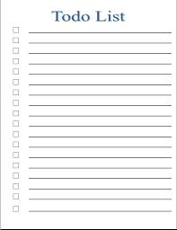

# 💭 Planejando o que será desenvolvido

<figure markdown>
  
  <figcaption></figcaption>
</figure>

## 💡 Definindo o que iremos desenvolver

Quando iniciamos um projeto, a primeira coisa que devemos conhecer são as "regras de negócio" do nosso projeto. Mas o que é isso?

É a descrição de como o nosso sistema deve ser e como deve se comportar diante da interação do usuário. Por exemplo, o sistema escolhido hoje é para organizar uma lista de tarefas.

## ✏️ Regras de negócio

O sistema será um gerenciador de tarefas e a primeira decisão é que nosso sistema deve apresentar uma interface que possa ser consumida tanto por um website, quanto por um aplicativo para dispositivos móveis.

Cada tarefa possui um identificador único, um título, uma descrição e seu estado que pode ser finalizado/não-finalizado.

O título deverá ter entre 3 e 50 caracteres e a descrição no máximo 140 caracteres.

Como usuário devo ser capaz de:

 - Adicionar e remover tarefas.

 - Listar todas as tarefas e o critério de ordenação é seu estado. Não finalizadas devem aparecer primeiro.

 - Mudar o estado de não-finalizado para finalizado.

 - Selecionar somente uma tarefa e exibi-la detalhadamente.

O sistema deve apresentar testes.

😨 E agora, o que fazer? Por onde começo? Vamos escolher nossas ferramentas!
