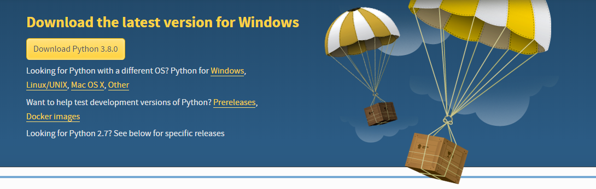
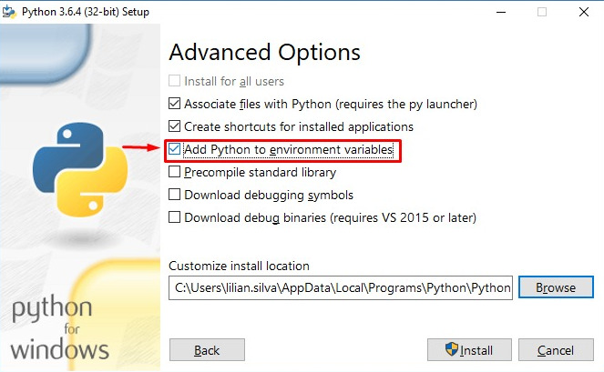

# :hammer: Escolhendo as melhores ferramentas

<p align="center">
  
</p>

## :fork_and_knife: Um bom chef escolhe as melhores ferramentas

Uma analogia que normalmente faço é que programar é igual a cozinhar, você deve escolher as melhores ferramentas. Um
bom chefe gasta algumas horas escolhendo quais acessórios serão necessários para a produção do prato e já deixa na bancada de
forma que não precise ficar procurando enquanto está produzindo seu prato.

Na programação também é assim, escolhemos as ferramentas necessárias para desenvolver, testar e colocar no ar nosso sistema.

Para este curso foram escolhidas algumas ferramentas e a partir de agora iremos ver como instalá-las e configurá-las para que
daqui pra frente não tenhamos que parar para fazer instalação de mais uma ferramenta.

As ferramentas foram escolhidas pensando na didática do aluno assim como compatibilidade de sistemas operacionais e também por
serem as principais escolhas no mercado de trabalho.

Siga os passos de acordo com o seu sistema operacional para cada ferramenta. Tenha sempre certeza de que a ferramenta está instalada e funcionando.

## :octocat: Git

**O que é?**

[Git](https://git-scm.com/) é um controle de versão livre e de código aberto, construido para lidar com projetos pequenos e grandes de maneira rápida e eficiente.

**Para que serve?**

Com certeza você já escreveu um arquivo, mais tarde troca algumas coisas e salva como final. Mais tarde ou no outro dia você decide fazer mais mudanças e chama de "agoravai" e quando menos percebe já tem um monte de arquivos e talvez nem se lembre mais qual a ultima versão.

É para gerenciar alterações feitas no projeto durante o tempo que serve esta ferramenta. Durante o curso vamos salvando cada progresso feito sem precisar de ter várias cópias do mesmo arquivo.

**Como instalar**

:computer: *windows*

Para usuários windows, baixe a última versão neste [site](https://git-scm.com://git-scm.com/). Deixe as opções já marcadas por padrão, exceto a mostrada abaixo que deve ser ajustada.


:package: *ubuntu*

O pacote git se encontra na central de programas.

`sudo apt install git`

**Vamos verificar se deu tudo certo?**

:computer: *windows*

Clique no botão iniciar, digite `cmd` e abra o programa `prompt de comandos`. Agora digite `git --version`.

:package: *ubuntu*

Abra um terminal e digite `git --version`.

A saída para ambos os sistemas operacionais deverá ser:

```bash
$ git --version
git version 2.24.0
```

## :snake: Python

**O que é?**

[Python](https://www.python.org/) é uma linguagem de programação com foco em legibilidade e produtividade, criada para escrever código bom e fácil de manter de maneira rápida.

**Para que serve?**

É uma linguagem bastante versátil, e hoje em dia é amplamente utilizada para escrever sistemas web, integrações entre sistemas, automatizar tarefas e muitas outras coisas.

**Como instalar**

:computer: *windows*

Entre em [python.org](https://www.python.org/), clique em downloads e depois selecione a versão 3.X, onde X é a versão atual mostrada no site.



Após baixar o instalador fique atento para selecionar a opção marcada na figura abaixo.



:package: *ubuntu*

Versões mais atuais do ubuntu já vem com o python 3 instalado, e inclusive, a partir da versão 17.10, essa passa a ser a versão padrão do sistema.

Caso python 3 não esteja instalado, utilize `sudo apt install python3`.

**Vamos verificar se deu tudo certo?**

:computer: *windows*

Clique no botão iniciar, digite `cmd` e abra o programa `prompt de comandos`. Agora digite `python3 --version`.

:package: *ubuntu*

Abra um terminal e digite `python3 --version`.

A saída para ambos os sistemas operacionais deverá ser:

```bash
$ python3 --version
Python 3.8.0
```

## :truck: Pip

**O que é?**

[Pip](https://pypi.python.org/pypi/pip) é o gerenciador de pacotes do python. É um cliente de linha de comandos utilizado para controle das depêndencias do projeto.

**Para que serve?**

Utilizaremos o pip para controlar a versão das bibliotecas utilizadas para desenvolvimento do sistema. O pip nos permite baixar uma versão específica de uma biblioteca como por exemplo `python3 -m pip install fastapi==0.43.0`.

**Como instalar**

:computer: *windows*

Não será necessário a instalação pois o mesmo já vem com o instalador da linguagem.

:package: *ubuntu*

Esta ferramenta não vem por padrão no sistema operacional ubuntu e pode ser instalada utilizando o comando `sudo apt install python3-pip`.

**Vamos verificar se deu tudo certo?**

:computer: *windows*

Clique no botão iniciar, digite `cmd` e abra o programa `prompt de comandos`. Agora digite `python3 -m pip --version`.

:package: *ubuntu*

Abra um terminal e digite `python3 -m pip --version`.

A saída para ambos os sistemas operacionais deverá ser similar a apresentada abaixo:

```bash
$ python3 -m pip --version
pip 19.2.3 from /usr/lib/python3.8/site-packages (python 3.8)
```

## :books: venv

**O que é?**

Responsável por criar ambientes virtuais Python e provê um isolamento dos pacotes instalados e suas respectivas versões.

É um cliente de linha de comando que auxilia na separação de ambientes para diferentes projetos.

**Para que serve?**

Iniciamos um projeto que tem uma biblioteca na versão `1.4`, e de repente, uma novo projeto é iniciado na versão `2.0`. O que fazer? Será que são compatíveis? E se eu atualizo o sitema e a versão antiga para de funcionar?

É onde o venv entra, ele serve para isolar ambientes entre projetos, ou seja, eu consigo ter dois projetos rodando, em dos ambientes diferentes, com versões diferentes da mesma biblioteca.

**Como instalar**

:computer: *windows*

Não será necessário a instalação pois o mesmo já vem com o instalador da linguagem.

:package: *ubuntu*

Versões atuais do ubuntu já vem com python 3 instalado. Para as mais antigas utilize o comando `sudo apt install python3-venv`.

**Vamos verificar se deu tudo certo?**

:computer: *windows*

Clique no botão iniciar, digite `cmd` e abra o programa `prompt de comandos`. Agora digite `python3 -m venv -h`. Se nada acontecer é porque deu certo.

:package: *ubuntu*

Abra um terminal e digite `python3 -m venv -h`.

A saída para ambos os sistemas operacionais deverá ser similar a apresentada abaixo:

```bash
$ python3 -m venv -h
usage: venv [-h] [--system-site-packages] [--symlinks | --copies] [--clear]
            [--upgrade] [--without-pip] [--prompt PROMPT]
            ENV_DIR [ENV_DIR ...]

Creates virtual Python environments in one or more target directories.

positional arguments:
  ENV_DIR               A directory to create the environment in.

optional arguments:
  -h, --help            show this help message and exit
  --system-site-packages
                        Give the virtual environment access to the system
                        site-packages dir.
  --symlinks            Try to use symlinks rather than copies, when symlinks
                        are not the default for the platform.
  --copies              Try to use copies rather than symlinks, even when
                        symlinks are the default for the platform.
  --clear               Delete the contents of the environment directory if it
                        already exists, before environment creation.
  --upgrade             Upgrade the environment directory to use this version
                        of Python, assuming Python has been upgraded in-place.
  --without-pip         Skips installing or upgrading pip in the virtual
                        environment (pip is bootstrapped by default)
  --prompt PROMPT       Provides an alternative prompt prefix for this
                        environment.

Once an environment has been created, you may wish to activate it, e.g. by
sourcing an activate script in its bin directory.
```

## :cloud: Heroku CLI

**O que é?**

O [Heroku](https://www.heroku.com/) é uma plataforma em nuvem como um serviço (PaaS) que suporta várias linguagens de programação usadas como um modelo de implantação de aplicativos da Web.

A CLI é uma interface de linha de comando que serve para facilitar a criação e o gerenciamento de aplicativos direto do terminal.

**Para que serve?**

Vamos utilizar o heroku para colocar nossa aplicação no ar e se tudo der certo, automatizar este processo. O CLI vai ajudar a fazer isto através do terminal.

**Como instalar**

:computer: *windows*

Vá no [site de download](https://devcenter.heroku.com/articles/heroku-cli#download-and-install) do heroku e baixe o instalador.


:package: *ubuntu*

Abra um terminal e digite `wget -qO- https://cli-assets.heroku.com/install-ubuntu.sh | sh`.

**Vamos verificar se deu tudo certo?**

:computer: *windows*

Clique no botão iniciar, digite `cmd` e abra o programa `prompt de comandos`. Agora digite `heroku --version`.

:package: *ubuntu*

Abra um terminal e digite `heroku --version`.

A saída para ambos os sistemas operacionais deverá ser similar a apresentada abaixo:

```bash
$ heroku --version
heroku/7.34.2 linux-x64 node-v10.16.3
```

:tada: Parabéns! Instalamos todas as ferramentas que precisaremos para acompanhar este curso, vamos para o próximo passo!

[Iniciando o projeto :arrow_right:](projeto.md)

[:arrow_left: Planejando o que será desenvolvido](planejando.md)

[:leftwards_arrow_with_hook: Voltar ao README ](README.md)
