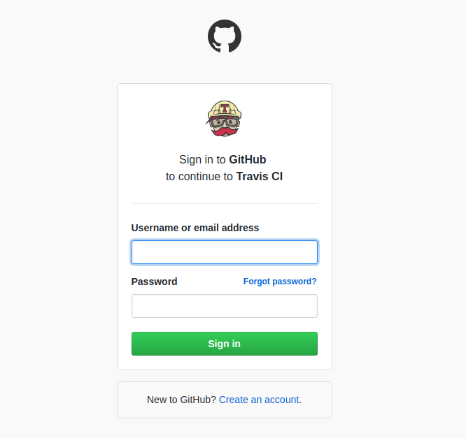

# :heavy_check_mark: Integração contínua

<p align="center">
  
</p>

## Conceito

O desenvolvedor integra o código alterado e/ou desenvolvido ao projeto principal na mesma frequência com que as funcionalidades são desenvolvidas, sendo feito muitas vezes.

Todo o nosso projeto será construído utilizando testes automatizados, e sempre rodaremos os testes localmente.

Mas como garantir que minha alteração não impacta com o restante do projeto, ter isto de forma simples e automatizada?
Como garantir que a qualidade do código foi mantida?

Utilizaremos o serviço [travis](https://travis-ci.org/) para checar que nosso código não quebra a "build", ou seja, quando integrado o novo código ao sistema, todo o sistema continua funcional.

Basicamente, a grande vantagem da integração contínua está no feedback instantâneo. Isso funciona da seguinte forma: a cada commit no repositório, o build é feito automaticamente, com todos os testes sendo executados de forma automática e falhas sendo detectadas. Se algum commit não compilar ou quebrar qualquer um dos testes, a equipe toma conhecimento instantâneamente (através de email, por exemplo, indicando as falhas e o commit causador das mesmas). A equipe pode então corrigir o problema o mais rápido possível, o que é fundamental para não introduzir erros ao criar novas funcionalidades, refatorar, etc. Integração contínua é mais uma forma de trazer segurança em relação a mudanças: você pode fazer modificações sem medo, pois será avisado caso algo saia do esperado.

## Passo a passo

Utilize sua conta do github para cadastrar no travis.



Seus projetos estarão listados da seguinte maneira


Escolha o projeto todoapp e habilite a integração contínua.


No seu projeto crie um arquivo chamado `.travis.yml` com o seguinte conteúdo.

```yaml
dist: xenial
language: python
python:
    - 3.8
install:
  - pip install -r dev-requirements.txt
script:
  - python -m pytest
```

:tada: Pronto, a partir de agora, o travis irá rodar todos os testes do seu projeto de forma automatizada e indicará se a construção do mesmo está com problemas.

Isto será extremamente útil nos próximos passos.

:floppy_disk: Para terminar a integração com travis, salve a versão atual do projeto e veja a primeira construção sendo realizada.

`$ git add .travis.yml`

`$ git commit -m "integração contínua"`

:octocat: Não esqueça de enviar ao github a versão atualizada do projeto, para disparar a nossa integração contínua.

`$ git push`

[Mandando um foguete pro espaço :arrow_right:](deploy.md)

[:arrow_left: Hello FastAPI](hello_fastapi.md)

[:leftwards_arrow_with_hook: Voltar ao README ](README.md)
