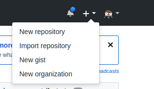
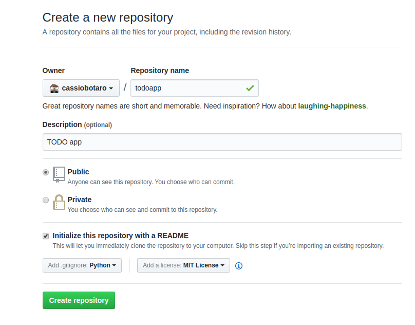

# Iniciando o projeto

<p align="center">
  
</p>

Já temos as espátulas, facas, colheres e outros instrumentos na mesa, mas para prosseguirmos, precisamos escolher os melhores ingredientes.

Desenvolver um projeto não significa escrever tudo do zero e poderemos contar com ajuda de trechos escritos por outros programadores. estes trechos comuns de código são chamados bibliotecas e vamos acabar adicionando algumas ao nosso projeto.

Mas antes de tudo, precisamos iniciar nosso projeto.

## :arrow_forward: Começando a tirar do papel o projeto

Daremos nosso primeiro passo, criando um diretório onde serão armazenados todos os arquivos do projeto.

Faremos isto utilizando o github, que é uma plataforma gratuita, muita conhecida e que irá nos ajudar com algumas integrações no futuro.

Mas por que iniciaremos criando o projeto lá e não no próprio computador?

O primeiro motivo é que já criaremos o projeto com controle de versão, ou seja a cada passo da sua criação vamos salvando as alterações, evitando que os passos se percam e caso necessário podemos desfazer algum passo errado.

Outro motivo é que se algo acontecer com seu computador, teremos salvo uma versão do projeto.

Abra seu navegador, e acesse o seguinte endereço http://github.com. Crie uma conta se ainda não tiver.

Aperte o botão novo_repositório.



Preencha os campos como visto na imagem abaixo.

:warning: As setas indicam o que deve ser preenchido.



Agora faça um "clone" do seu repositório.

:warning: Os comandos abaixo devem ser modificados com seu email e nome de usuário do github. USUARIO deve ser modificado para seu usuário do github e EMAIL substituido pelo email utilizado no github.

```bash
$ git clone https://github.com/USUARIO/gerenciador-tarefas.git
Cloning into 'gerenciador-tarefas'...
remote: Counting objects: 5, done.
remote: Compressing objects: 100% (4/4), done.
remote: Total 5 (delta 0), reused 0 (delta 0), pack-reused 0
Unpacking objects: 100% (5/5), done.

```

`git clone` é um comando para criar uma cópia dos arquivos e suas versões. Pode ser feito para trazer uma cópia do repositório do servidor para o computador local.

Aproveite e já configure seu usuário git para este projeto, dentro do diretório recém clonado digite os seguintes comandos.

```bash
$ git config --local user.email EMAIL

$ git config --local user.name USUARIO
```

"Voilà", já temos o projeto iniciado.

Navegue até o diretório onde foi executado o comando de `clone` do projeto. Prossiga com a instalação das bibliotecas de acordo com o seu sistema operacional.

:warning: Não se esqueça de entrar no diretório do projeto antes de continuar a instalação das bibliotecas.

## :computer: O ambiente virtual

Iniciei um projeto e ele utiliza a biblioteca fastapi na versão 0.2, três meses depois fui iniciar outro e a versão do fastapi já era 0.3.

Será que não dá problema se eu mudar no primeiro projeto? Ou será que mudo no segundo?

Para evitar este tipo de problema, vamos criar o que chamaremos de ambiente virtual.

Na prática o que vamos fazer é instalar as bibliotecas em um diretório que está relacionado ao projeto. Assim cada projeto pode ter suas próprias bibliotecas na versão que quiser.

O comando para isto é `python3 -m venv .venv`, ou `python -m venv .venv` no windows, sendo que .venv é o nome deste ambiente isolado.

Este ambiente isolado será visto como um diretório criado na pasta do projeto.

O ponto na frente do nome faz com que o diretório fique oculto.

Depois de criado, temos de ativar este ambiente e isto é importante pois sempre que decidir trabalhar neste projeto você deverá repetir este passo.

Digite o comando: `source .venv/bin/activate` em linux ou `.venv\Scripts\activate.bat` no windows.

Pronto, agora estamos preparados para instalar as bibliotecas que precisaremos.

## :books: Bibliotecas e utilitários

Chegou a hora de instalar algumas bibliotecas e utilitários que nos auxiliarão na criação do nosso sistema web, na realização de testes unitários e testes manuais.

Siga os passos de acordo com o seu sistema operacional para cada ferramenta. Tenha sempre certeza de que a ferramenta está instalada e funcionando.

:warning: Certifique-se de que seu ambiente está ativo antes de prosseguir com as instalações.

### :zap: FastAPI

**O que é?**

O [fastapi](https://fastapi.tiangolo.com) é uma ferramenta para desenvolvimento web, possui alta performance, fácil de aprender, rápida para escrever código e pronta para colocar o código no ar.

**Para que serve?**

Serve para escrevermos nossa aplicação web de forma rápida e customizável.

Possui funções que auxiliam operações como roteamento, tratamento de requisições, renderização de conteúdo, gerenciamento de sessão e cookies, assim como várias outras que são típicas da web.

**Como instalar**

:warning: Preste atenção que os comandos serão executados dentro do diretório do projeto.

:computer: *windows*

Clique no botão iniciar, digite `cmd` e abra o programa `prompt de comandos`. Navegue ate o nosso projeto e agora digite `pip install fastapi`.

:package: :apple: *ubuntu* ou *mac*

Abra um terminal, navegue até a pasta do projeto e por fim digite `pip install fastapi`.

**Vamos verificar se deu tudo certo?**

:computer: *windows*

Clique no botão iniciar, digite `cmd` e abra o programa `prompt de comandos`. Agora digite `python -c "import fastapi"`. nenhum erro deve ocorrer.

:package: :apple: *ubuntu* ou *mac*

Abra um terminal e digite `python -c "import fastapi"`. nenhum erro deve ocorrer.

### :link: Httpie

**O que é?**

[HTTPie](https://github.com/jakubroztocil/httpie) é um cliente HTTP por linha de comando. Seu objetivo é transformar a interação com serviços web o mais humano possível.

**Para que serve?**

Diversos momentos do curso, teremos de testar manualmente se nosso sistema está funcionando, ainda que possua testes automatizados.

Esta ferramenta ajuda a fazer estes testes de uma maneira mais simples.

**Como instalar**

:computer: *windows*

Clique no botão iniciar, digite `cmd` e abra o programa `prompt de comandos`. Navegue ate o nosso projeto e agora digite `pip install httpie`.

:package: :apple: *ubuntu* ou *mac*

Abra um terminal, navegue até a pasta do projeto e por fim digite `pip install httpie`.

**Vamos verificar se deu tudo certo?**

:computer: *windows*

Clique no botão iniciar, digite `cmd` e abra o programa `prompt de comandos`. Agora digite `http --version`.

:package: :apple: *ubuntu* ou *mac*

Abra um terminal e digite `http --version`.

:warning: Note que foi utilizado o comando http ao invés de httpie, este é o nome do executável do httpie depois de instalado no sistema.

A saída para ambos os sistemas operacionais deverá ser similar a apresentada abaixo:

```bash
$ http --version
1.0.3
```

### :unicorn: Uvicorn

**O que é?**

O uvicorn é um servidor de aplicação com suporte a frameworks assíncronos.

**Para que serve?**

O uvicorn serve para rodar a nossa aplicação, tanto na nossa máquina quanto em um servidor na internet.

**Como instalar**

:computer: *windows*

Clique no botão iniciar, digite `cmd` e abra o programa `prompt de comandos`. Navegue ate o nosso projeto, ative o ambiente virtual e agora digite `pip install uvicorn`.

:package: :apple: *ubuntu* ou *mac*

Abra um terminal, navegue até a pasta do projeto, ative o ambiente virtual e por fim digite `pip
install uvicorn`.

**Vamos verificar se deu tudo certo?**

:computer: *windows*

Clique no botão iniciar, digite `cmd` e abra o programa `prompt de comandos`. Ative o ambiente virtual, Agora digite `uvicorn --help`.

:package: :apple: *ubuntu* ou *mac*

Abra um terminal e digite `uvicorn --help`.

A saída para ambos os sistemas operacionais deverá ser similar a apresentada abaixo:

```bash
Usage: uvicorn [OPTIONS] APP

Options:
  --host TEXT                     Bind socket to this host.  [default:
                                  127.0.0.1]
  --port INTEGER                  Bind socket to this port.  [default: 8000]
  --uds TEXT                      Bind to a UNIX domain socket.
  --fd INTEGER                    Bind to socket from this file descriptor.
  --reload                        Enable auto-reload.
  --reload-dir TEXT               Set reload directories explicitly, instead
                                  of using the current working directory.
  --workers INTEGER               Number of worker processes. Defaults to the
                                  $WEB_CONCURRENCY environment variable if
                                  available. Not valid with --reload.
  --loop [auto|asyncio|uvloop|iocp]
                                  Event loop implementation.  [default: auto]
  --http [auto|h11|httptools]     HTTP protocol implementation.  [default:
                                  auto]
  --ws [auto|none|websockets|wsproto]
                                  WebSocket protocol implementation.
                                  [default: auto]
  --lifespan [auto|on|off]        Lifespan implementation.  [default: auto]
  --interface [auto|asgi3|asgi2|wsgi]
                                  Select ASGI3, ASGI2, or WSGI as the
                                  application interface.  [default: auto]
  --env-file PATH                 Environment configuration file.
  --log-config PATH               Logging configuration file.
  --log-level [critical|error|warning|info|debug|trace]
                                  Log level. [default: info]
  --access-log / --no-access-log  Enable/Disable access log.
  --proxy-headers / --no-proxy-headers
                                  Enable/Disable X-Forwarded-Proto,
                                  X-Forwarded-For, X-Forwarded-Port to
                                  populate remote address info.
  --forwarded-allow-ips TEXT      Comma seperated list of IPs to trust with
                                  proxy headers. Defaults to the
                                  $FORWARDED_ALLOW_IPS environment variable if
                                  available, or '127.0.0.1'.
  --root-path TEXT                Set the ASGI 'root_path' for applications
                                  submounted below a given URL path.
  --limit-concurrency INTEGER     Maximum number of concurrent connections or
                                  tasks to allow, before issuing HTTP 503
                                  responses.
  --limit-max-requests INTEGER    Maximum number of requests to service before
                                  terminating the process.
  --timeout-keep-alive INTEGER    Close Keep-Alive connections if no new data
                                  is received within this timeout.  [default:
                                  5]
  --ssl-keyfile TEXT              SSL key file
  --ssl-certfile TEXT             SSL certificate file
  --ssl-version INTEGER           SSL version to use (see stdlib ssl module's)
                                  [default: 2]
  --ssl-cert-reqs INTEGER         Whether client certificate is required (see
                                  stdlib ssl module's)  [default: 0]
  --ssl-ca-certs TEXT             CA certificates file
  --ssl-ciphers TEXT              Ciphers to use (see stdlib ssl module's)
                                  [default: TLSv1]
  --header TEXT                   Specify custom default HTTP response headers
                                  as a Name:Value pair
  --help                          Show this message and exit.

```

### :traffic_light: Pytest

**O que é?**

O framework [pytest](https://docs.pytest.org/en/latest/) é fácil para escrever teste simples, ainda escala para suportar testes funcionais complexos para aplicações e bibliotecas.

**Para que serve?**

Já dizia Michael C. Feathers, "Um código sem testes, é um código ruim. Não importa quão bem ele foi escrito".  Vamos então instalar o pytest, que é uma ferramenta que auxilia na execução de testes.

**Como instalar**

:computer: *windows*

Clique no botão iniciar, digite `cmd` e abra o programa `prompt de comandos`. Navegue ate o nosso projeto e agora digite `pip install pytest`.

:package: :apple: *ubuntu* ou *mac*

Abra um terminal, navegue até a pasta do projeto e por fim digite `pip install pytest`.

**Vamos verificar se deu tudo certo?**

:computer: *windows*

Clique no botão iniciar, digite `cmd` e abra o programa `prompt de comandos`. Agora digite `pytest --version`.

:package: :apple: *ubuntu* ou *mac*

Abra um terminal e digite `pytest --version`.

A saída para ambos os sistemas operacionais deverá ser similar a apresentada abaixo:

```bash
$ pytest --version
This is pytest version 5.3.0, imported from /home/cassiobotaro/projects/gerenciador-tarefas/.venv/lib/python3.8/site-packages/pytest.py
```

## :warning: Nota importante sobre ambientes virtuais

Se neste momento, você digitar `cmd` no windows, ou abrir um terminal no linux e digitar `python3` ou `python` no windows, e em seguida tentar importar a bilbioteca fastapi o seguinte erro será mostrado. :scream:

```bash
$ python3
Python 3.8.0 (default, Oct 16 2019, 11:21:38)
[GCC 9.2.0] on linux
Type "help", "copyright", "credits" or "license" for more information.
>>> import fastapi
Traceback (most recent call last):
  File "<stdin>", line 1, in <module>
ModuleNotFoundError: No module named 'fastapi'
>>>
```
:pushpin: Utilize `Ctrl + d` ou `exit()` para sair do python.

Acontece que instalamos o flask somente no ambiente virtual. Para entrarmos no ambiente virtual digite `source <venv>/bin/activate` ou `<venv>\Scripts\activate.bat`.

Não esqueça de trocar o `<venv>` pelo nome do ambiente virtual criado. Por exemplo, se você seguiu esse tutorial, provavelmente você usou o nome `.venv`, então o comando será `source .venv/bin/activate` ou `.venv\Scripts\activate.bat`.

## Salvando o momento atual do nosso projeto

Neste momento seu diretório deve estar assim:

```
.
├── LICENSE
└── README.md
```

E se eu te pedisse agora uma cópia do projeto, como eu saberia de toda essa lista de coisas necessárias pro código rodar?

Para evitar este problema criaremos arquivos com as dependências que instalamos no nosso projeto.

Vamos começar criando um arquivo chamado requirements.txt com o seguinte conteúdo.

```
fastapi==0.45.0
uvicorn==0.11.1
```

Depois criaremos um segundo arquivo chamado `dev-requirements.txt` e colocaremos o seguinte conteúdo.

```
-r requirements.txt
pytest==5.3.2
httpie==1.0.3
```

:warning: Os arquivos devem ser criados na pasta principal do projeto. Teremos então os seguintes arquivos no nosso diretório.

```
.
├── LICENSE
├── README.md
├── dev-requirements.txt
└── requirements.txt
```

Por que arquivos separados?

No `requirements.txt`, só colocamos aquelas bibliotecas realmente necessárias para o sistema ir ao ar, já no `dev-requirements.txt`, temos as depêndencias que somente são úteis enquanto estamos desenvolvendo o sistema.

Aquele `-r requirements.txt` no arquivo de desenvolvimento garante que as dependências principais serão instaladas e em seguidas as outras que somente são úteis durante o desenvolvimento.

Quando formos colocar o site no ar, estes arquivos serão bem úteis.

Instalado as dependências, vamos salvar uma primeira versão do nosso projeto com o nosso andamento?

Primeiro passo é checar o que foi feito até agora:

```bash
$ git status
On branch master
Your branch is up to date with 'origin/master'.

Untracked files:
  (use "git add <file>..." to include in what will be committed)
	dev-requirements.txt
	requirements.txt

nothing added to commit but untracked files present (use "git add" to track)
```

Vemos dois arquivos não rastreados, precisamos avisar ao controle de versão que monitore estes arquivos.

`$ git add requirements.txt dev-requirements.txt`

:floppy_disk: Agora vamos marcar esta versão como salva.

`git commit -m "adicionando dependências do projeto"`

:octocat: Por fim, envie ao github a versão atualizada do projeto.

`git push`

:cake: Entusiasmados a começar a escrever sua aplicação? Agora que temos todo o ambiente configurado, já estamos bem próximo disso, faremos um nivelamento de conhecimento sobre web e python e em breve termos nossa aplicação no ar!

[Um pouco sobre a web :arrow_right:](web.md)

[:arrow_left: Escolhendo as melhores ferramentas](ferramentas.md)

[:leftwards_arrow_with_hook: Voltar ao README ](README.md)
